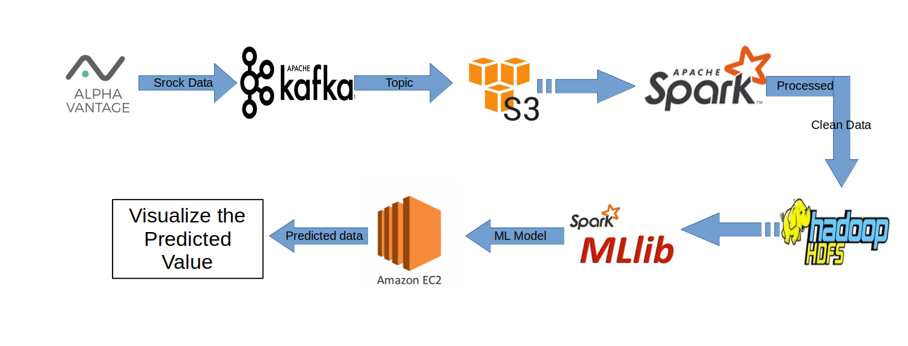

# Stock Price Prediction Project

This project focuses on predicting Google stock price on real time data. I used Google (GOOGL) stock data for training and built an effective model for predicting stock prices and displayed the predictions on webpage using Flask, Kafka and Highcharts.


     
  

### Architecture for Stock price prediction project



#

## Prerequisites:

- Python3
```
$ sudo apt-get install python3
$ sudo apt-get install python3-pip
```

#

## What the project does and how it was made?
- This project has been built using Python3 to help predict the future stock close prices of Google stock with the help of Machine Learning and Data Visualization in real time.
- To start, I created an AWS account and created a user with all access.
- Downloaded the Amazon CLI on my system and then added the AWS access keys to be accessed globally.
- Next I started creating python script to create a bucket and upload the downloaded CSV file onto the AWS bucket. To do this, I needed to install the boto3.

#### ***What is boto3?***
***Boto3 is the Amazon Web Services (AWS) Software Development Kit (SDK) for Python, which allows Python developers to write software that makes use of services like Amazon S3 and Amazon EC2.***

#### ***What is Amazon S3 Bucket?***
***An Amazon S3 bucket is a public cloud storage resource available in Amazon Web Services' (AWS) Simple Storage Service (S3), an object storage offering. Amazon S3 buckets, which are similar to file folders, store objects, which consist of data and its descriptive metadata.***

- After creating and uploading my CSV file, I fetched the file from my S3 bucket with the help of Pandas.
- Since no data is clean and has missing values, it needs to be cleaned.
- Now after the data has been cleaned, we can now built a model using Machine Learning. Keep in mind, the less data we use the higher chances of underfitting occur and the more data we use, the higher chances of overfitting occur. So we need to choose the data not more, not less.
- The model building process has been done using PySpark’s mlib Library.

#### ***What is PySpark?***
***Apache Spark is written in Scala programming language. To support Python with Spark, Apache Spark community released a tool, PySpark. Using PySpark, you can work with RDDs in Python programming language also. It is because of a library called Py4j that they are able to achieve this.***

- I used Linear Regression to train the model and used the Regression Evaluator to give the accuracy of my model.
- After the successfull buliding of my model, I needed to check if it works on real data. For that I registered on a website called AlphaVantage and generated the key to access the live data from their site.

#### ***What is AlphaVantage?***
***Alpha Vantage Inc. is a company that provides realtime and historical stock APIs as well as forex (FX) and digital/crypto currency data feeds.***

- Now comes the fun part of testing the model using Data Visualization.
- For this, firstly I had to install Apache Zookeeper and Apache Kafka.

#### ***What is Apache Zookeeper?***
***ZooKeeper is a centralized service for maintaining configuration information, naming, providing distributed synchronization, and providing group services. All of these kinds of services are used in some form or another by distributed applications. Each time they are implemented there is a lot of work that goes into fixing the bugs and race conditions that are inevitable. Because of the difficulty of implementing these kinds of services, applications initially usually skimp on them, which make them brittle in the presence of change and difficult to manage. Even when done correctly, different implementations of these services lead to management complexity when the applications are deployed.***

#### ***What is Apache Kafka?***
***Apache Kafka is a distributed publish-subscribe messaging system and a robust queue that can handle a high volume of data and enables you to pass messages from one end-point to another. Kafka is suitable for both offline and online message consumption. Kafka messages are persisted on the disk and replicated within the cluster to prevent data loss. Kafka is built on top of the ZooKeeper synchronization service. It integrates very well with Apache Storm and Spark for real-time streaming data analysis.***

- To display the prediction in real time, we first need to start the Zookeeper server and then start the Kafka server.
- I created the Producer and Consumer scripts in Python3 and ran them through Flask app.

#### ***What is Flask?***
***Flask is a web application framework written in Python. Flask is based on the Werkzeug WSGI
toolkit and Jinja2 template engine. The Flask framework uses Werkzeug as one of its bases. Werkzeug is a WSGI toolkit, which implements requests, response objects, and other utility functions. This enables building a web framework on top of it. Web Server Gateway Interface (WSGI ) is a specification for a universal interface between the web server and the web applications. It has been adopted as a standard for Python web application development. Jinja2 is a popular templating engine for Python. A web templating system combines a template with a certain data source to render dynamic web pages.***

- Finally, to display the graph I used Highcharts JS in my HTML file and styled it through CSS.

#

Using ALPHA VANTAGE API to predict google stock price.

- Using [ALPHA VANTAGE](https://www.alphavantage.co/) to genrate API Key.

- Using this API key to Download Google Stock Price data for each 1 min interval.

- [Create S3 bucket](https://boto3.amazonaws.com/v1/documentation/api/latest/guide/s3-example-creating-buckets.html) using boto3. (Boto is the Amazon Web Services (AWS) SDK for Python. It enables Python developers to create, configure, and manage AWS services, such as EC2 and S3. Boto provides an easy to use, object-oriented API, as well as low-level access to AWS services.)

- After creating [bucket upload](https://boto3.amazonaws.com/v1/documentation/api/latest/guide/s3-uploading-files.html) **stock data** into bucket using boto3.

-  Reading data from S3 and doing some preprocessing.

- After preprocessing train a Linear Regression model and save model weights.

- Installing [kafka and zookeeper](https://tecadmin.net/install-apache-kafka-ubuntu/) into system and install [python-kafka](https://pypi.org/project/kafka-python/)

- Start zookeeper and kafka server into local system and connect python-kafka to local host.
    ```
    $cd $KAFKA_HOME
    
    $./bin/zookeeper-server-start.sh config/zookeeper.properties
    $./bin/kafka-server-start.sh config/server.properties

    ```

    ### Preprocessing the data to clean it and Creating ML model
* 1.Create a notebook and load create a spark session
* from pyspark.sql import SparkSession
* spark= SparkSession.builder.appName('Stock processing').getOrCreate()

### 2.Load the data we fetched in spark dataframe
* dataset=spark.read.csv("google_stock_data")

### 3.Check the dataframe columns
* dataset.columns

### 4. Clean the column as they are not in expected format for analysis
* dataset2=dataset.withColumnRenamed('["time"','time')\
* .withColumnRenamed(' "open"','open')\
* .withColumnRenamed(' "high"','high')\
* .withColumnRenamed(' "low"','low')\
* .withColumnRenamed(' "close"','close')\
* .withColumnRenamed(' "volume"]','volume')


### 5. Check the final cleaned data

|       time        |   open  |  high   |  low    | close   |volume |
|-------------------|---------|---------|---------|---------|-------|
|2021-09-03 19:00:00| 139.55  | 139.55  | 139.55  | 139.55  | 2749  |
|2021-09-03 17:45:00| 139.65  | 139.65  | 139.65  | 139.65  | 150   |
|2021-09-03 16:15:00| 139.58  | 139.61  | 139.55  | 139.55  | 31003 |
|2021-09-03 16:00:00| 139.765 | 139.885 | 139.54  | 139.62  | 269779|
|2021-09-03 15:45:00| 139.69  | 139.769 | 139.635 | 139.769 | 79292 |
|2021-09-03 15:30:00| 139.8399| 139.86  | 139.655 | 139.69  | 49114 |
|2021-09-03 15:15:00| 139.76  | 139.88  | 139.75  | 139.83  | 50153 |
|2021-09-03 15:00:00| 139.78  | 139.84  | 139.72  | 139.74  | 38715 |
|2021-09-03 14:45:00| 139.61  | 139.78  | 139.59  | 139.78  | 31959 |
|2021-09-03 14:30:00| 139.6829| 139.6861| 139.57  | 139.6311| 31552 |
|2021-09-03 14:15:00| 139.63  | 139.72  | 139.57  | 139.69  | 34371 |
|2021-09-03 14:00:00| 139.76  | 139.76  | 139.63  | 139.64  | 36656 |
|2021-09-03 13:45:00| 139.69  | 139.78  | 139.65  | 139.76  | 28612 |
|2021-09-03 13:30:00| 139.65  | 139.73  | 139.629 | 139.67  | 30235 |
|2021-09-03 13:15:00| 139.49  | 139.65  | 139.48  | 139.64  | 35199 |
|2021-09-03 13:00:00| 139.46  | 139.515 | 139.4104| 139.47  | 32583 |
|2021-09-03 12:45:00| 139.45  | 139.47  | 139.35  | 139.46  | 34212 |
|2021-09-03 12:30:00| 139.47  | 139.5   | 139.33  | 139.43  | 34336 |
|2021-09-03 12:15:00| 139.4451| 139.54  | 139.39  | 139.52  | 35873 |
|2021-09-03 12:00:00| 139.5201| 139.56  | 139.43  | 139.48  | 32806 |


### 6.Convert data types of columns to desired format
* df2 = newDf.withColumn("open",col("open").cast("double"))\
* .withColumn("high",col("high").cast("double"))\
* .withColumn("low",col("low").cast("double"))\
* .withColumn("close",col("close").cast("double"))\
* .withColumn("volume",col("volume").cast("int"))

### 7. Check for null values by converting spark df to pandas df
* pandaDf=newDf.toPandas()
* pandaDf.isna().sum()


## CREATING A ML MODEL
* Import necessary things
* from pyspark.ml.linalg import Vectors
* from pyspark.ml.feature import VectorAssembler
* from pyspark.ml.regression import LinearRegression

### 2. Create features columns with vector assembler
* featureassembler=VectorAssembler(inputCols=["open","high","low"],outputCol="Features")

### 3. Trasform the data set accordingly
* output=featureassembler.transform(df2)

### 4. Sort data in ascending order
* finalized_data=output.select("time","Features","close").sort("time",ascending=True)

### 5. Split data into test and train data with window function
* final_data=finalized_data.withColumn("rank",percent_rank().over(Window.partitionBy().orderBy("time")))
* train_data = final_data.where("rank <= .8").drop("rank")
* test_data = final_data.where("rank > .8").drop("rank")

### 6. Write test data to parquet file for further use
* test_df.write.parquet('test_data')

### 7. Create model with linear regression algoritham
* regressor=LinearRegression(featuresCol='Features', labelCol='close')
* lr_model=regressor.fit(train_data)

### 8.Check for coefficient and intercepts
* lr_model.coefficients
* lr_model.intercept

### 9. Make prediction by transforming data in model
* pred= lr_model.transform(test_data)
* pred.select("Features","close","prediction").show()
* Output:

| Features           |close | prediction       |
|--------------------| -----|------------------|
|[139.045,139.085,...|138.98| 139.0088189816052|
|[138.97,138.98,13...|138.97|138.98604284027746|
|[139.21,139.21,13...|139.21| 139.218743620076 |
|[138.81,138.81,13...|138.81|138.81953685610827|
|[138.81,139.05,13...|139.05|138.98329554207902|
|[139.4355,139.435...| 138.9|139.03487193320166|
|[139.25,139.25,13...|139.25|139.25866429647274|
|[138.97,138.97,13...|138.97|138.97921956169534|
|[139.43,139.59,13...|139.59|139.53984348571282|

### 10. Save model to HDFS

* lr_model.save(“Stock_Model”)

- **Create a Topic in Kafka**

    Create a topic in kafka using below query. Before create kafka topic you go to kafka folder.
    ```
    $cd $KAFKA_HOME

    $./bin/kafka-topics.sh --create --zookeeper localhost:2181 --replication-factor 1 --partitions 1 --topic stockml
    ```
    
    The replication-factor describes how many copies of data will be created. As we are running with a single instance keep this value 1.

    Set the partitions options as the number of brokers you want your data to be split between. As we are running with a single broker keep this value 1.

    You can create multiple topics by running the same command as above. After that, you can see the created topics on Kafka by the running below command:

    ```
    bin/kafka-topics.sh --list --zookeeper localhost:2181
    ```

- **Send Messages to Kafka**

    The **producer** is the process responsible for put data into our Kafka. The Kafka comes with a command-line client that will take input from a file or from standard input and send it out as messages to the Kafka cluster. The default Kafka sends each line as a separate message.

    ```
    bin/kafka-console-producer.sh --broker-list localhost:9092 --topic stockml
    ```

- **Using Kafka Consumer**

    Kafka also has a command-line consumer to read data from the Kafka cluster and display messages to standard output.

    The first argument is the topic, numtest in our case.
    
    bootstrap_servers=[‘localhost:9092’]: same as our producer

    ```
    bin/kafka-console-consumer.sh --bootstrap-server localhost:9092 --topic stockml --from-beginning
    ```
- **Now using python KafkaProducer to connect the local kafka host**

    bootstrap_servers=[‘localhost:9092’]: sets the host and port the producer should contact to bootstrap initial cluster metadata. It is not necessary to set this here, since the default is localhost:9092.

- **Using KafkaConsumer to predict stocks data**

    Using **KafkaConsumer** to get data from producer. After geting data we load save model which save previously when train the model. Using these model we predict close value.

- **Create Flask API**

    In flask I have created 2 URL:

    1. "/" for main page which rander index.html template for showing predicting close and actual close value.
    2. "/data" this is for send data to index.html page for showing graph.

## How To Run

- First start zookeeper and kafka server.
- Run producer file. (``` python3 producer.py ```)
- Run app file. (``` python3 app.py ```)

# Deploying stock prediction model on EC2 instance

### Create EC2 t2.small instance
### Now add another security group to EC2 instance and give all traffic permission to inbound rule.
### Connect to EC2 instance using FileZilla and Upload all the project files and kafka to ec2 instance.
### From terminal connect to EC2 instance using ssh command

```
ssh -i stockKey.pem ubuntu@ec2-3-108-249-9.ap-south-1.compute.amazonaws.com
```
#
### Update apt and python3-pip using this command
```
sudo apt-get update && sudo apt-get install python3-pip
```
## Install all the requirements using requirements.txt
```
pip3 install -r requirements.txt
```
## Install java jvm 8 in ec2 instance
```
sudo apt install openjdk-8-jre-headless
```
## Run kafka as usual and then run app.py in ec2 instance
```
./bin/zookeeper-server-start.sh config/zookeeper.properties

./bin/kafka-server-start.sh config/server.properties

./bin/kafka-topics.sh --create --zookeeper localhost:2181 --replication-factor 1 --partitions 1 --topic stockml
```
- Run producer file. (``` python3 producer.py ```)
- Run app file. (``` python3 app.py ```)


